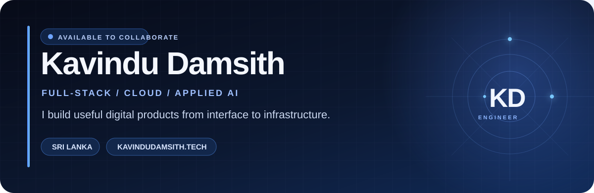

  

  <a href="https://kavindudamsith.tech/">Portfolio</a> ·
  <a href="https://www.linkedin.com/in/kavindu-damsith-86696722a/">LinkedIn</a> ·
  <a href="mailto:kavindudamsith65@gmail.com">Email</a>

## Building useful products, from interface to infrastructure

I'm Kavindu, a full-stack developer based in Sri Lanka. My work spans commercial web applications, mobile products, cloud deployments, and applied computer vision. I like understanding a complete workflow, building its core, and refining the details people use every day.

My Computer Science & Engineering studies at the **University of Moratuwa** and my engineering internship at **Cloud Solutions International** shape that approach. I completed my degree's academic requirements in June 2026.

Currently, I'm working on **Maple Wraps**, an event-floor-wrap platform for a Canadian business, and **ForkNetRT**, a real-time video super-resolution research project focused on latency, efficiency, and reconstruction quality.

## Selected work

| Project | What I worked on | Explore |
| :--- | :--- | :--- |
| **Maple Wraps** | A live storefront and evolving platform for configurable quotes, event workflows, and collaboration. | [Live website](https://maplewraps.ca/) |
| **ForkNetRT / VSR Pipeline** | Real-time video super-resolution research, supported by streaming controls, preview, metadata, and monitoring interfaces. | [Research](https://connect.cse.uom.lk/projects/115) · [Code](https://github.com/kavindu-damsith-65/VsrPipelineV2) |
| **PlateShare** | A food-sharing mobile platform with buyer, seller, delivery, and organisation roles. I primarily developed the buyer module and fully implemented organisation and delivery functionality. | [Code](https://github.com/kavindu-damsith-65/PlateShare) |
| **HealthLink** | A competition project joining healthcare workflows with a deep-learning pipeline for brain-tumour MRI analysis. | [Code](https://github.com/kavindu-damsith-65/healthLink) |
| **Antikythera** | Internship contributions to a Spring test automation tool: testing its dependency solver, investigating edge cases, and improving reliability. | [Repository](https://github.com/kavindu-damsith-65/antikythera) |
| **TrainGPS** | Railway safety experiments combining real-time location, historical-data risk estimation, and driver-attention monitoring. | [Code](https://github.com/kavindu-damsith-65/trainGpsv3) |

My private work also includes **HyperTalk**, a sign-language communication application; **Abacus Learning**, a children's mental-calculation platform for a UK client; and a **Cinema Booking Platform** with reservations, payments, and refunds. Read the public summaries on my [portfolio](https://kavindudamsith.tech/#work), or [contact me](mailto:kavindudamsith65@gmail.com) to discuss my contributions.

## Tools I work with

- **Product development:** React, TypeScript, JavaScript, React Native, Flutter, Tailwind CSS.
- **Backend and data:** Node.js, Express, Django, Flask, Spring Boot, MySQL, MongoDB.
- **Cloud and delivery:** Linux, Docker, Kubernetes, Jenkins, Git, Prometheus.
- **Applied AI:** Python, PyTorch, TensorFlow, OpenCV, YOLO, FFmpeg.

During my internship, I worked with Jenkins pipelines, Docker containers, a multi-node Kubernetes cluster, HPA/VPA scaling, and JVM/resource tuning with Prometheus monitoring.

## Competition results

| Year | Competition | Result |
| :--- | :--- | :--- |
| 2024 | MoraXtreme 9.0 | **1st place** out of 350+ teams |
| 2023 | CYPHER 23 Hackathon | **Winner**, team competition |
| 2021 | Hackdoze 1.0 Hackathon | **1st runner-up** |
| 2023 | BrainStorm Innovation Competition | **2nd runner-up**, team HYPERTALK project |
| 2024 | ENIGMA 24 — Crack the Code | **4th place**, team finals |
| 2023 | MoraXtreme 8.0 | **8th place** out of 300+ teams |

## Let's connect

I'm interested in software engineering opportunities and collaborations across full-stack development, cloud systems, and applied AI.

**[kavindudamsith65@gmail.com](mailto:kavindudamsith65@gmail.com)** · [Portfolio](https://kavindudamsith.tech/) · [LinkedIn](https://www.linkedin.com/in/kavindu-damsith-86696722a/)
