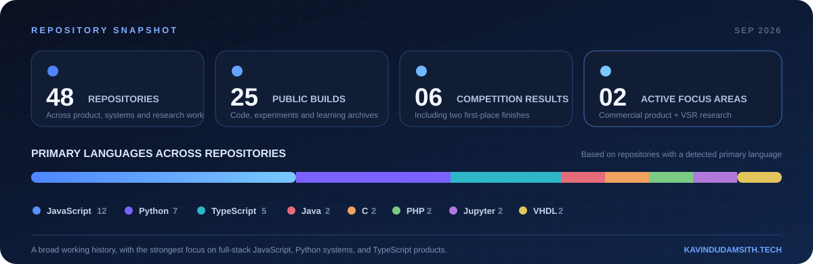

<p align="center">
  
</p>

<p align="center">
  
</p>

<p align="center">
  <a href="https://kavindudamsith.tech/"></a>
  <a href="https://www.linkedin.com/in/kavindu-damsith-86696722a/"></a>
  <a href="https://mail.google.com/mail/?view=cm&amp;fs=1&amp;to=kavindudamsith65%40gmail.com"></a>
</p>

<p align="center">
  
  
  
</p>

## Hello, I'm Kavindu

I'm a full-stack developer who enjoys owning the whole path from a product idea to a dependable release. My work spans responsive web and mobile experiences, backend services, cloud infrastructure, applied machine learning, computer vision, and real-time video systems.

I completed the academic requirements for my **B.Sc. (Hons) in Computer Science & Engineering** at the **University of Moratuwa** in June 2026. My engineering internship at **Cloud Solutions International** strengthened my experience with Java and Spring tooling, Jenkins pipelines, Docker, Kubernetes, autoscaling, resource tuning, and Prometheus-based monitoring.

```text
CURRENT FOCUS
├── Maple Wraps     → Commercial event-floor-wrap platform for a Canadian business
├── ForkNetRT       → Real-time video super-resolution research
├── Product craft   → Clear interfaces backed by maintainable systems
└── Open to         → Ambitious software engineering projects and collaborations
```

## What I build

<table>
  <tr>
    <td width="33%" valign="top">
      <h3>🖥️ Product engineering</h3>
      <p>Responsive interfaces and complete application flows shaped around real people, business needs, and careful interaction design.</p>
      <p><code>React</code> <code>TypeScript</code> <code>Next.js</code> <code>React Native</code> <code>Flutter</code></p>
    </td>
    <td width="33%" valign="top">
      <h3>☁️ Backend & cloud</h3>
      <p>Practical APIs, data layers, CI/CD foundations, containers, orchestration, and observable systems that can evolve safely.</p>
      <p><code>Node.js</code> <code>Spring</code> <code>Django</code> <code>Docker</code> <code>Kubernetes</code></p>
    </td>
    <td width="33%" valign="top">
      <h3>🧠 Intelligent systems</h3>
      <p>Machine-learning and computer-vision pipelines integrated into usable products, research tools, and real-time workflows.</p>
      <p><code>Python</code> <code>PyTorch</code> <code>OpenCV</code> <code>YOLO</code> <code>FFmpeg</code></p>
    </td>
  </tr>
</table>

## Featured work

<table>
  <tr>
    <td width="50%" valign="top">
      <h3>🍁 <a href="https://maplewraps.ca/">Maple Wraps</a></h3>
      <p>A live product for a Canadian event-floor-wrap business, bringing configurable quotations, customer projects, uploads, promotions, communication, administration, and event collaboration into one platform.</p>
      <p><code>React</code> <code>Next.js</code> <code>TypeScript</code> <code>Express</code> <code>MongoDB</code></p>
      <a href="https://maplewraps.ca/"></a>
    </td>
    <td width="50%" valign="top">
      <h3>🎞️ <a href="https://github.com/kavindu-damsith-65/VsrPipelineV2">ForkNetRT / VSR Pipeline</a></h3>
      <p>Real-time video super-resolution research supported by a CUDA/NVENC streaming producer, source metadata, live previews, playback control, and React and PySide monitoring surfaces.</p>
      <p><code>Python</code> <code>PyTorch</code> <code>FFmpeg</code> <code>CUDA</code> <code>React</code></p>
      <a href="https://connect.cse.uom.lk/projects/115"></a>
      <a href="https://github.com/kavindu-damsith-65/VsrPipelineV2"></a>
    </td>
  </tr>
  <tr>
    <td width="50%" valign="top">
      <h3>🍽️ <a href="https://github.com/kavindu-damsith-65/PlateShare">PlateShare</a></h3>
      <p>A multi-role mobile platform for redistributing food instead of wasting it. I primarily developed the buyer module and fully implemented the organisation and delivery workflows.</p>
      <p><code>React Native</code> <code>Expo</code> <code>Express</code> <code>MySQL</code> <code>Stripe</code></p>
      <a href="https://github.com/kavindu-damsith-65/PlateShare"></a>
    </td>
    <td width="50%" valign="top">
      <h3>🩺 <a href="https://github.com/kavindu-damsith-65/healthLink">HealthLink</a></h3>
      <p>A competition-built healthcare platform connecting patients, doctors, appointments, reports, and a ResUNet pipeline for brain-tumour MRI segmentation.</p>
      <p><code>React</code> <code>Node.js</code> <code>Flask</code> <code>ResUNet</code> <code>Kubernetes</code></p>
      <a href="https://github.com/kavindu-damsith-65/healthLink"></a>
    </td>
  </tr>
  <tr>
    <td width="50%" valign="top">
      <h3>🚆 <a href="https://github.com/kavindu-damsith-65/trainGpsv3">TrainGPS</a></h3>
      <p>A railway-safety prototype combining ESP32 GPS capture, geospatial data, crack and location-risk experiments, and real-time driver-attention monitoring.</p>
      <p><code>Python</code> <code>Django</code> <code>ESP32</code> <code>Geospatial ML</code></p>
      <a href="https://github.com/kavindu-damsith-65/trainGpsv3"></a>
    </td>
    <td width="50%" valign="top">
      <h3>🧪 <a href="https://github.com/kavindu-damsith-65/antikythera">Antikythera</a></h3>
      <p>Open-source Spring test-generation tooling. During my internship, I tested its dependency solver, investigated edge cases, and contributed reliability improvements.</p>
      <p><code>Java</code> <code>Spring</code> <code>JavaParser</code> <code>Maven</code> <code>JUnit</code></p>
      <a href="https://github.com/kavindu-damsith-65/antikythera"></a>
    </td>
  </tr>
</table>

> My private commercial work also includes **HyperTalk**, a sign-language communication platform; **Abacus Learning**, a children's mental-calculation product for a UK client; and a **Cinema Booking Platform** with reservations, payments, and refund workflows. Detailed public summaries are available on my [portfolio](https://kavindudamsith.tech/#work).

## Technology toolkit

<p align="center">
  <strong>Languages</strong><br/><br/>
  
</p>

<p align="center">
  <strong>Frontend & mobile</strong><br/><br/>
  
</p>

<p align="center">
  <strong>Backend, data & intelligent systems</strong><br/><br/>
  
</p>

<p align="center">
  <strong>Cloud & engineering workflow</strong><br/><br/>
  
</p>

## Journey

| Period | Chapter | What shaped my work |
| :--- | :--- | :--- |
| **2022 - 2026** | 🎓 **B.Sc. (Hons) in Computer Science & Engineering** · University of Moratuwa | Software engineering, databases, distributed systems, AI/ML, computer vision, and substantial team projects. |
| **Industry** | 🏢 **Engineering Internship** · Cloud Solutions International | Professional product delivery, Spring tooling, Jenkins, Docker, multi-node Kubernetes, HPA/VPA tuning, and Prometheus monitoring. |
| **Current** | 🚀 **Commercial products and research** | Building Maple Wraps while advancing ForkNetRT real-time video super-resolution research. |
| **Ongoing** | 🌱 **Independent engineering** | Exploring full-stack products, cloud platforms, developer tooling, embedded systems, and applied deep learning. |

## Competition highlights

| Place | Competition | Result |
| :---: | :--- | :--- |
| 🥇 | **MoraXtreme 9.0** · 2024 | Finals champion after Team White Lotus placed first in eliminations among **350+ teams**. |
| 🥇 | **CYPHER 23 Hackathon** · 2023 | Winner of the six-hour physical coding competition organised by IEEE WIE at KDU. |
| 🥈 | **Hackdoze 1.0** · 2021 | First runner-up. |
| 🥉 | **BrainStorm Innovation Competition** · 2023 | Second runner-up with Team Hyper Bits for the **HyperTalk** accessibility project. |
| **04** | **ENIGMA 24 - Crack the Code** · 2024 | Fourth place in the team finals. |
| **08** | **MoraXtreme 8.0** · 2023 | Eighth place among **300+ teams**. |

## Repository snapshot

<p align="center">
  
</p>

<p align="center">
  
</p>

<h3 align="center">Have an ambitious product, platform, or intelligent-system idea?</h3>

<p align="center">
  I enjoy turning difficult engineering problems into clear, useful experiences.<br/>
  <strong>Let's build something thoughtful.</strong>
</p>

<p align="center">
  <a href="https://mail.google.com/mail/?view=cm&amp;fs=1&amp;to=kavindudamsith65%40gmail.com"></a>
</p>
